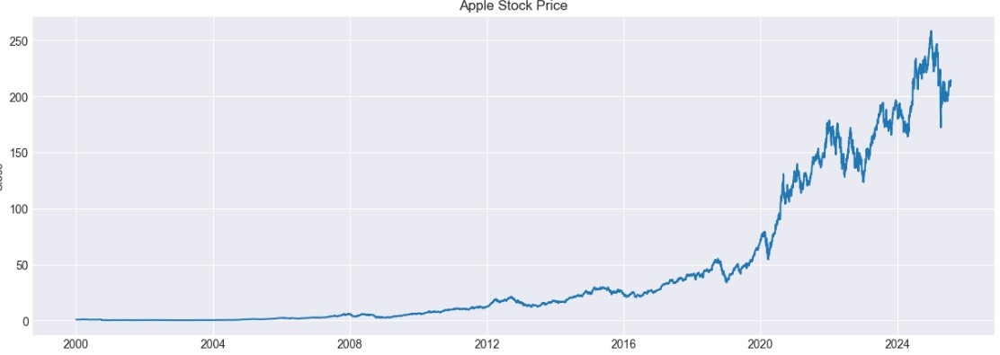
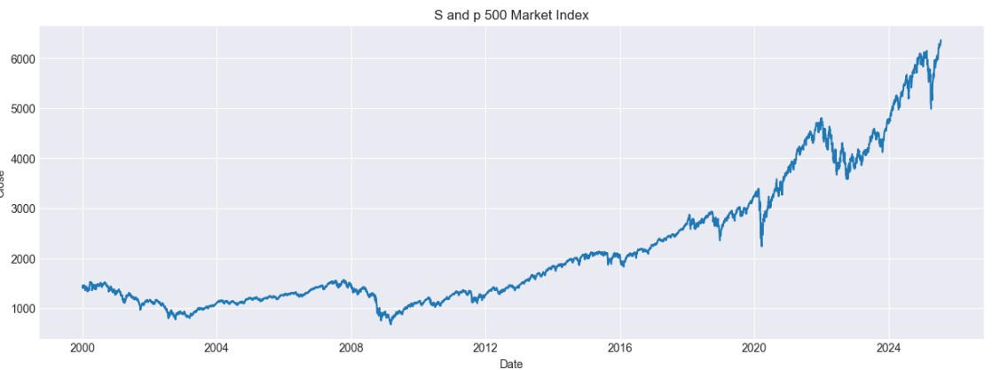
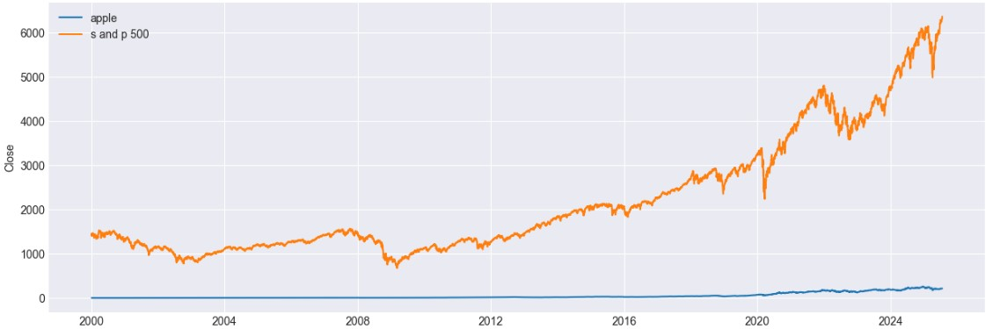
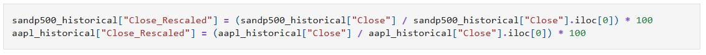
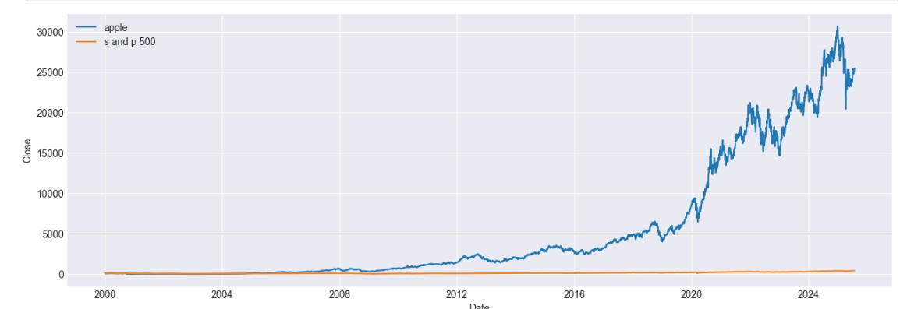
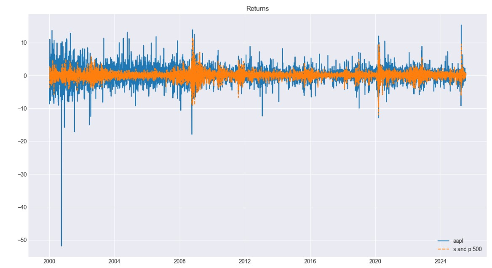

# StockMarket-Analysis_Apple-SandP500
This repository contains a comprehensive comparative financial analysis between Apple Inc. and the S&P 500 Index using historical stock data from Yahoo Finance, leveraging Python libraries such as pandas(data manipulation), yfinance(fetch stock market data), and matplotlib(Visualization).

## Table of Contents
1. [Introduction](#introduction)
2. [Need of Study](#need-of-study)
3. [Dataset](#dataset)
4. [Tools & Techniques](#tools-techniques)
5. [Data Preperation and Understanding](data-prep)
    - [Phase I - Data Extraction and Cleaning](phase-1)
    - [Phase II - Exploratory Data Analysis](#phase-2)
6. [Analysis](#analysis)
    - [Rebasing](#rebasing)
    - [Returns](#returns)
7. [Key Findings](#key-findings)
8. [Conclusion](#conclusion)

## Introduction 
This project analyzes Apple Inc. alongside the S&P 500 to compare individual stock performance with the broader market. By examining returns, volatility, and trends, it highlights core risk–return concepts and the importance of portfolio diversification in investment decisions.

## Need of Study
This study is needed to understand how an individual stock like Apple behaves in comparison to a broad market index such as the S&P 500. By analyzing their risk and return characteristics, the study helps investors learn how diversification can reduce risk, improve portfolio stability, and support informed investment decision-making.

## Dataset
The dataset used in this study consists of historical daily stock price data for Apple Inc. and the S&P 500 index. It includes variables such as date, opening price, closing price, high, low, adjusted close, and trading volume, which are used to calculate returns, volatility, and risk measures for comparative analysis.

Spread of the Dataset
•	6427 total records
•	7 fields

## Data Preperation and Understanding
One of the first steps engaged in was to outline the sequence of steps that will be following for the project. Each of these steps are elaborated below:
**Target Field**
The "Close" Price was selected as field of interest. This would be later used to claculate new fields like "return".

### Phase I - Data Extraction and Cleaning
- Historical Stock Data of Apple and S and P 500 were collected using yfinance python library. It provides easy access to Financial data from Yahoo Finance directly into dataframe format. I extracted : Apple Inc (AAPL) stock data, S and p 500 (^GSPC) data
- Including fields like Open, High, Low, Close, Volume, Dividends, and Stock Splits
- Data quality assurance- dataset was inspected for missing or null values.
  

### Phase II - Exploratory Data Analysis
- Line graph  was used for initial visualization of "close" price of Apple , S and P 500.
</img>
</img>
- The line plots show the historical closing prices of apple and the s and p 500 over time , allowing for visual comparison of their market performance
</img>
- The Apple and the S and P 500's historical closing prices plotted on the same graph to visualize their market trends over time. However, since their absolute price levels differ significantly, the chart doesn't allow for a direct comparison of the performance.
  

##  Analysis
  

**Rebasing**
- The solution to the price level varying is rebasing.
- Rebasing is the process of converting a time series (like stock prices) to a common starting value-usually 100-to make relative comparisons easier.
</img>
-Different assets (like apple stock and s and p 500 index) often have very different price levels. For Example Apple might start at 150 while s and p 500 might start at 3000. If we just plot their raw prices, It's hard to tell which one grew more over time.
- Rebasing  transforms each data point into a percentage of thr starting value, so both series start at 100. Advantages includes ability to see how much each asset has increased/ decreased over time, focus on performance and not price level.
- After rebasing, the graph is again plotted.
</img>
  

  ** Returns : Tracking gains and looses daily**
- Return refers to the gain or loss made on an investment over a specific period, typically expressed as a percentage. It relects how much an investor earns relative to the initial investment.
- Analysing returns rather than just price provides deeper insights into an assset's performance, volatility, and risk.
- Daily returns , in particular , help us understand  short-term market movements and how sensitive a stock is to market events.
- This analysis is crucial for comparing investments on a relative basis and for evaluating how consistently an asset generates profit over time.
</img>

  

## Key Findings

## Conclusions

